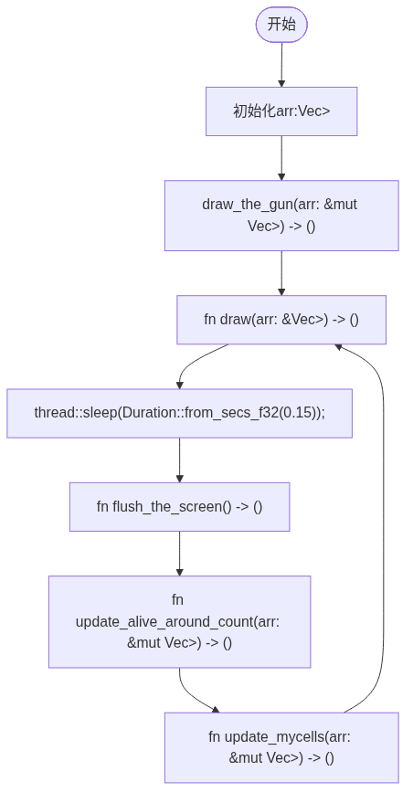

# 我的源码仓库

-   [github](https://github.com/tinyblinker/life_game)
-   [gitee](https://gitee.com/tinyblinker/life_game)


# 简介

康威生命游戏（英语：Conway's Game of Life），又称康威生命棋,是英国数学家约翰·何顿·康威在1970年发明的细胞自动机.  
它最初于1970年10月在《科学美国人》杂志上马丁·葛登能的“数学游戏”专栏出现.  


# 核心规则

每个细胞有两种状态- 存活或死亡，每个细胞与以自身为中心的周围八格细胞产生互动（如图，黑色为存活，白色为死亡）  

-   当前细胞为存活状态时，当周围的存活细胞低于2个时（不包含2个），该细胞变成死亡状态。（模拟生命数量稀少）
-   当前细胞为存活状态时，当周围有2个或3个存活细胞时，该细胞保持原样。
-   当前细胞为存活状态时，当周围有超过3个存活细胞时，该细胞变成死亡状态。（模拟生命数量过多）
-   当前细胞为死亡状态时，当周围有3个存活细胞时，该细胞变成存活状态。（模拟繁殖）


# 代码实现


## (核心) fn main()

-   核心的程序循环所在处

```rust
fn main() {
    // init an 2D vector
    let cols: usize = 40;
    let rows: usize = 100;
    let mut arr: Vec<Vec<MyCell>> = (0..cols)
        .map(|_| {
            (0..rows)
                .map(|_| MyCell {
                    is_alive: false,
                    alive_around_cnt: 0,
                })
                .collect()
        })
        .collect();

    // draw the gun(绘制"高斯帕机枪")
    draw_the_gun(&mut arr);

    // start the main loop("开始进行核心主循环")
    loop {
        draw(&arr);
        thread::sleep(Duration::from_secs_f32(0.15));
        flush_the_screen();
        update_alive_around_count(&mut arr);
        update_mycells(&mut arr);
    }
}
```


## (核心) struct MyCell

-   is\_alive: true->当前细胞存活,flase->当前细胞死亡;  
    alive\_around\_cnt->当前细胞周围的存活细胞数量;

```rust
struct MyCell {
    is_alive: bool,
    alive_around_cnt: usize,
}
```


## fn draw\_the\_gun(arr: &mut Vec<Vec<MyCell>>) -> ()

-   绘制高斯帕机枪

```rust
fn draw_the_gun(arr: &mut Vec<Vec<MyCell>>) -> () {
    let directions: [(usize, usize); 36] = [
        (24, 0),
        (22, 1),
        (24, 1),
        (12, 2),
        (13, 2),
        (20, 2),
        (21, 2),
        (34, 2),
        (35, 2),
        (11, 3),
        (15, 3),
        (20, 3),
        (21, 3),
        (34, 3),
        (35, 3),
        (0, 4),
        (1, 4),
        (10, 4),
        (16, 4),
        (20, 4),
        (21, 4),
        (0, 5),
        (1, 5),
        (10, 5),
        (14, 5),
        (16, 5),
        (17, 5),
        (22, 5),
        (24, 5),
        (10, 6),
        (16, 6),
        (24, 6),
        (11, 7),
        (15, 7),
        (12, 8),
        (13, 8),
    ];
    for (dr, dc) in directions {
        set_seeds_alive(arr, dr + 2, dc + 25);
    }
}  

```


## fn draw(arr: &Vec<Vec<MyCell>>) -> ()

-   绘制"一次"当前的生命游戏图("O"表示存活细胞,"-"表示死亡细胞)

```rust
// draw the current cells' status
fn draw(arr: &Vec<Vec<MyCell>>) -> () {
    for i in arr {
        for j in i {
            match j.is_alive {
                true => print!("O"),
                false => print!("-"),
            }
        }
        print!("\n");
    }
}
```


## thread::sleep(Duration::from\_secs\_f32(0.15))

-   就是让当前的程序停止0.15秒再运行,防止"draw()"  
    还没在终端画完所有字符就继续执行了

```rust
thread::sleep(Duration::from_secs_f32(0.15));
```


## fn flush\_the\_screen() -> ()

-   向终端写入"\x1B[2J\x1B[H"清空屏幕并把光标移动到左上角

```rust
fn flush_the_screen() -> () {
    print!("\x1B[2J\x1B[H");
}
```


## fn update\_alive\_around\_count(arr: &mut Vec<Vec<MyCell>>) -> ()

-   遍历arr,更新arr中每个MyCell(细胞)周围的存活细胞数并存入MyCell结构体  
    的"alive\_around\_cnt"成员中,方便统一管理MyCell

```rust
fn update_alive_around_count(arr: &mut Vec<Vec<MyCell>>) -> () {
    let max_cols: usize = arr.len() - 1;
    let max_rows: usize = arr[0].len() - 1;
    for i in 0..max_cols {
        for j in 0..max_rows {
            match count_cells_around(&arr, i, j) {
                -1 => continue,
                count => arr[i][j].alive_around_cnt = count as usize,
            }
        }
    }
}
```


## fn update\_mycells(arr: &mut Vec<Vec<MyCell>>) -> ()

-   遍历arr,根据MyCell结构体中的"alive\_around\_cnt"和  
    "is\_alive"判断"下一代"时当前细胞的"is\_alive"状态

```rust
fn update_mycells(arr: &mut Vec<Vec<MyCell>>) -> () {
    let max_cols: usize = arr.len() - 1;
    let max_rows: usize = arr[0].len() - 1;
    for i in 0..max_cols {
        for j in 0..max_rows {
            match arr[i][j].is_alive {
                true => {
                    if arr[i][j].alive_around_cnt < 2 {
                        arr[i][j].is_alive = false;
                    } else if arr[i][j].alive_around_cnt > 3 {
                        arr[i][j].is_alive = false;
                    }
                }
                false => {
                    if arr[i][j].alive_around_cnt == 3 {
                        arr[i][j].is_alive = true;
                    }
                }
            }
        }
    }
}
```


# 程序流程图

  

-   求值结果

  


# 杂谈总结

才疏学浅,想着练练手于是开始写这个有意思的小项目,然后记录一下过程  
,后面也会继续写着几个有意思的小项目拿来分享;作为rust初学者,写这  
个代码过程中还是遇到很多困难,但我尽量避免了使用ai辅助编码和答疑  
以更加充分地训练自己快速学习一个新的编程语言的能力,还有阅读保存信  
息,查阅文档的能力;这次写代码让我发现自己似乎更喜欢这种按照兴趣自  
由探索书写代码的过程,我似乎更喜欢一个没有明确目的的"冒险式"编程,  
而不是去做八股文的算法题(但是适当做那些算法题目还是很有必要的orz.  
好吧大概就是这样,一个小无聊又小有趣的生命游戏极简原型的博客就写这  
么多吧哈哈
